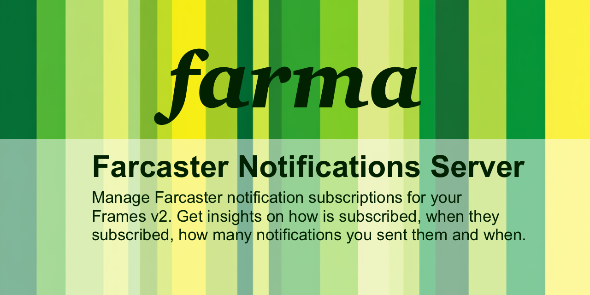

**Don't use it yet, it's still pre-alpha.**



# farma

**farma** (**FA**rcaster **R**elationships **MA**nagement) is built to make Farcaster Frames v2
notifications easy, and help you get insights on how users interact with your
frames notifications.

- When did a user first add your frame?
- How many notifications have you sent them since?
- When did they enable/disable notifications
- Which Farcaster clients are they using to interact with your frame?

# Setup

(This will improve a lot, but in case someone wants to give it an early try.)

## 1. Download binary
Download the binary corresponding to your system from `https://github.com/vrypan/farma/releases`.
If you're using macOS, use `brew install vrypan/farma/farma`

## 2. Setup
Run `farma setup`.

Make sure you save the private key. The key is used to sign API requests,
and you will need it even if you are using the CLI commands (they actually use the API
under the hood)

If you are ok with it being in plain text in the config file, use
`farma config set key.private <private_key>` to save it there.

Alternatively, you can `export FARMA_KEY_PRIVATE=<private_key>` to avoid haveing to pass it manually
to the following commands.

## 3. Start the server
Start the farma server: `farma server`

## 4. Configure a frame
Assuming you already have your frame, you need to configure it in farma.
You will need a short name for your frame, and the frame domain.

If you want to call your frame `myframe`, and its domain is `farma.vrypan.net`, you have to run:
`farma frame-add myframe farma.vrypan.net`

## 5. Update .well-knows/farcaster.json
The previous command returned a relative endpoint, something like `/f/a2b01541-778d-4a2b-9375-8232c70a6ddf`.

Hint: You can use `farma frames-list` to get all frames and endpoints configured:

Add the endpoint (including your server name) in the frame's `.well-known/farcaster.json` callbackUrl.

For example,

```
"webhookUrl": "https://my-frame-notifications.com/f/a2b01541-778d-4a2b-9375-8232c70a6ddf"
```

**Make sure you re-validate the frame in Warpcast dev tools.**

## 6. Send notifications!
You can send a notification to all users subscribed to a frame:

```
farma notification-send "myframe" "Hello" "Hello, there!" ""
```

# TODO

- [x] Support multiple frames and multiple clients per user
- [x] Handle subscriptions/unsubscriptions
- [x] Group FIDs in batches of 100 when sending notifications
- [x] Handle invalidTokens
- [ ] Handle rateLimitedTokens
- [x] Validate subscription signatures
- [x] Validate AppKeys used to sign subscription signatures
- [x] Log user subscription/unsubscriptions
- [ ] Installation instructions
- [ ] Support access to nodes that require authentication
- [ ] Guide admins on how to use the commands, add checks
- [x] Expose REST API (basic functionality)
- [ ] Webhooks?
- [ ] Log notifications sent
